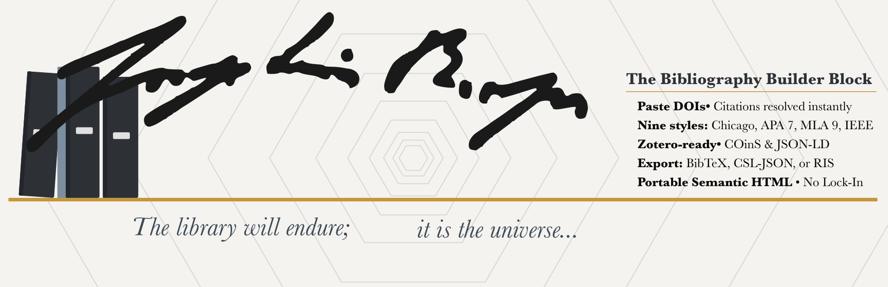
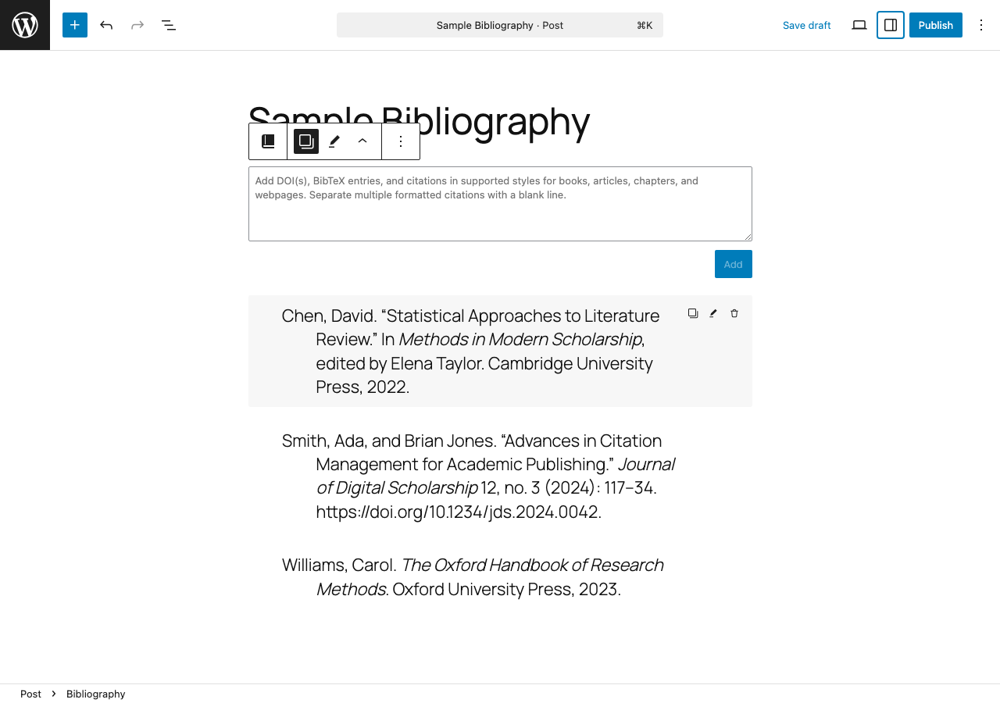
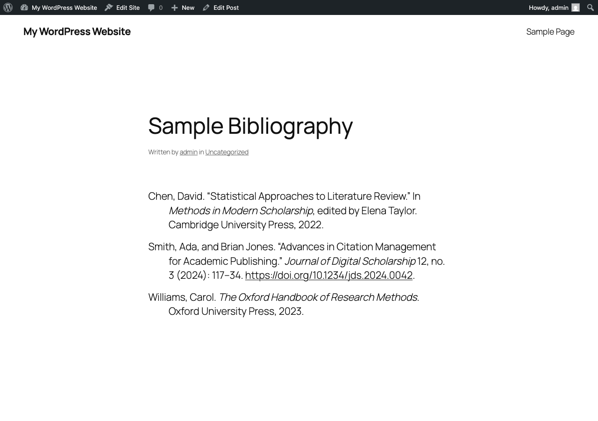
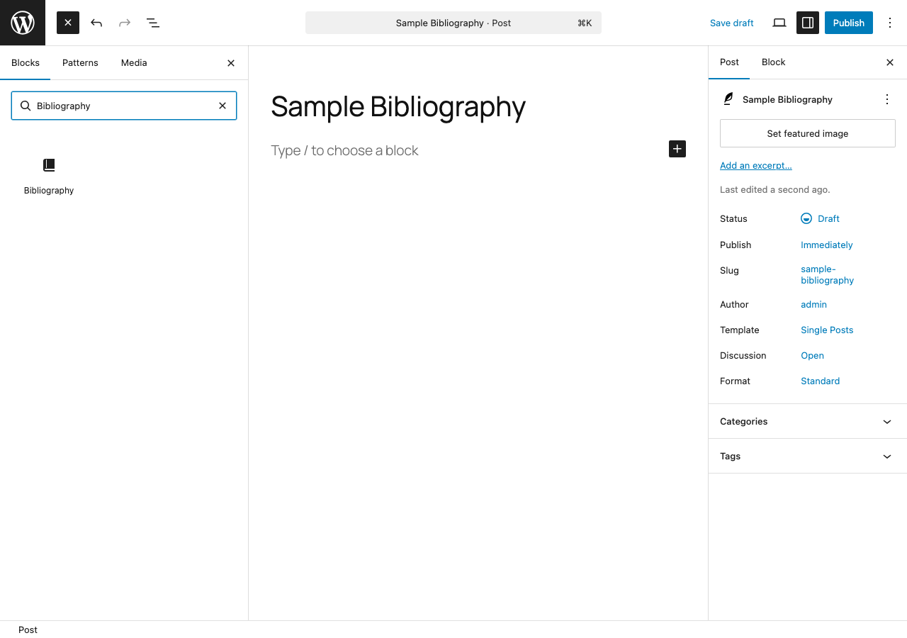
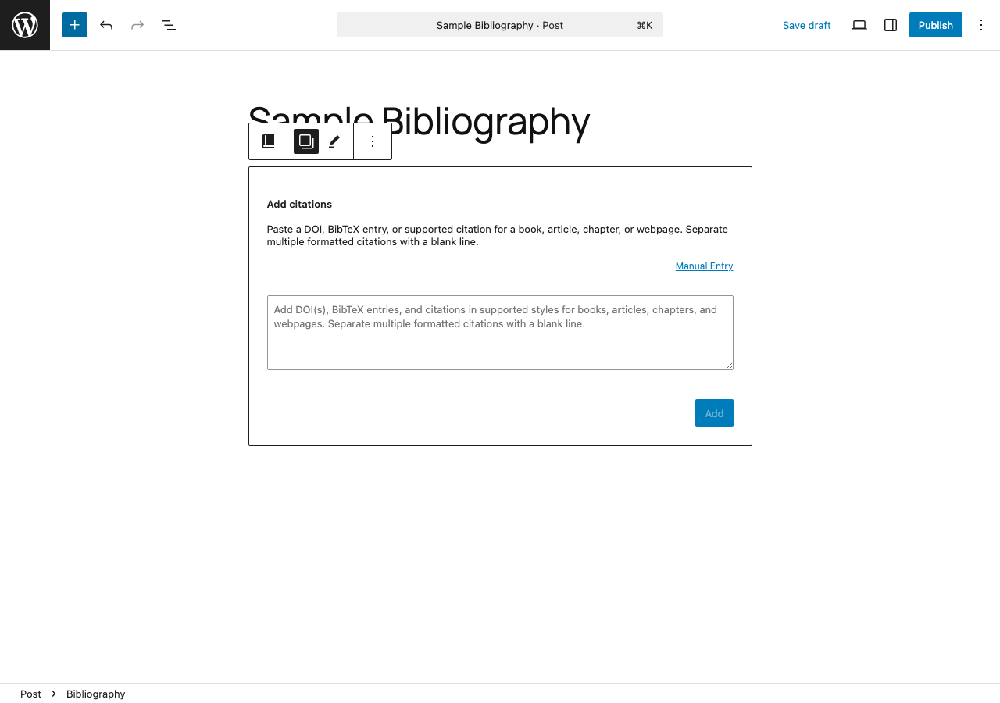
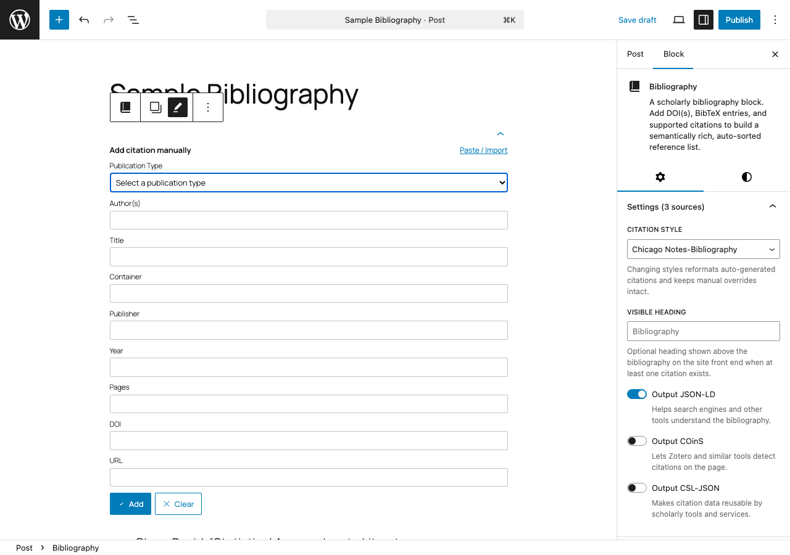

# Bibliography

[](https://www.gnu.org/licenses/gpl-2.0.html)
[](https://github.com/dknauss/wp-bibliography-block/actions/workflows/runtime-matrix.yml)
[](https://github.com/dknauss/wp-bibliography-block/actions/workflows/runtime-matrix.yml)
[](https://github.com/dknauss/wp-bibliography-block/actions/workflows/ci.yml)
[](https://github.com/dknauss/wp-bibliography-block/actions/workflows/runtime-matrix.yml)
[](https://github.com/dknauss/wp-bibliography-block/actions/workflows/codeql.yml)
[](https://codecov.io/gh/dknauss/wp-bibliography-block)
[](https://playground.wordpress.net/?blueprint-url=https://raw.githubusercontent.com/dknauss/wp-bibliography-block/main/playground/blueprint.json)



The only all-in-one bibliography block for the WordPress editor that transforms pasted scholarly references — DOI(s), BibTeX entries, and supported formatted citations — into a semantically rich, auto-sorted bibliography with static saved output. Export your work as CSL-JSON, BibTeX, and RIS.

No shortcodes. No database storage. Static HTML output survives plugin deactivation.

## Try it in WordPress Playground

Launch a disposable WordPress instance with the plugin preinstalled:

- [Open Scholarly Bibliography Block in WordPress Playground](https://playground.wordpress.net/?blueprint-url=https://raw.githubusercontent.com/dknauss/wp-bibliography-block/main/playground/blueprint.json)

The Playground installs the plugin from the latest GitHub Release zip artifact.

## Screenshots

| Editor with citations | Front-end output |
|---|---|
|  |  |

| Block inserter | Empty-state form | Manual entry |
|---|---|---|
|  |  |  |

## Installation

1. Upload the plugin files to `/wp-content/plugins/scholarly-bibliography/`, or install directly through the WordPress plugin screen.
2. Activate the plugin through the **Plugins** screen in WordPress.
3. Add the **Bibliography** block to any post or page.
4. Paste DOI(s), BibTeX entries, or supported citations.

## Compatibility

- **WordPress** 6.4–7.0 (block.json v3 requires 6.4+)
- **PHP** 7.4+ (minimal PHP runtime — the plugin registers a block and REST endpoints only)
- **Multisite** — expected to work (block registration is site-local by default), but not yet tested

The GitHub Actions runtime matrix covers PHP 7.4 through 8.4 and WordPress 6.4 through latest on both Apache and Nginx. Multisite-specific and SQLite runtime e2e tests are on the backlog.

## Features

- **Multiple input paths** — add bare DOIs, DOI URLs, BibTeX entries, and supported formatted citations
- **Nine citation styles** — Chicago Notes-Bibliography by default, with Chicago Author-Date, APA 7, Harvard, Vancouver, IEEE, MLA 9, OSCOLA, and ABNT selectable
- **Structured editing** — plain-text editing plus per-field editing for heuristic or warning-marked citations
- **Semantic output** — DPUB-ARIA bibliography roles, `<cite>` wrappers, `lang` attributes, and hanging-indent styling
- **JSON-LD** — Schema.org structured data for search engines, AI systems, and semantic consumers (on by default)
- **COinS** — optional OpenURL spans for browser-based citation manager detection (useful for Zotero and similar tools)
- **CSL-JSON output** — optional machine-readable metadata for tool interoperability (useful for scholarly services that consume structured data)
- **Export** — download the current bibliography as CSL-JSON, BibTeX, or RIS; copy individual citations or the full bibliography as plain text
- **Static save** — bibliography HTML and metadata are baked into post content at save time
- **Accessible editor UX** — focus management, block-local Gutenberg notices, keyboard escape/cancel flows, and row action controls

## Supported Input

### First-class inputs

- **Bare DOI** — `10.1000/xyz123`
- **DOI URL** — `https://doi.org/10.1000/xyz123`
- **BibTeX** — `@article{key, title={...}, ...}`

### Supported formatted citation coverage

The free-text parser currently supports a growing set of formatted citations for:

- books
- journal articles
- chapters
- webpages / social posts
- reviews
- theses / dissertations

Support is heuristic rather than universal. Unsupported inputs fail closed with a block-local inline Gutenberg notice. Manual entry is now available as a fallback for unsupported formats.

## API

The plugin exposes a read-only REST endpoint for bibliography data:

- `GET /wp-json/scholarly-bibliography/v1/posts/<post_id>/bibliographies`
- `GET /wp-json/scholarly-bibliography/v1/posts/<post_id>/bibliographies/<index>`

Behavior:

- published posts are readable publicly
- non-public posts require permission to edit the post
- the collection route returns each bibliography block found in the post, including style settings and citation data
- the single-bibliography route supports `?format=json`, `?format=text`, and `?format=csl-json`

## External Services

This plugin connects to the [CrossRef REST API](https://api.crossref.org/) when you paste a DOI to resolve citation metadata. No account or API key is required. Requests are made only when you explicitly add a DOI in the block editor — no data is sent automatically or in the background.

- [CrossRef](https://www.crossref.org/)
- [CrossRef REST API documentation](https://api.crossref.org/swagger-ui/index.html)
- [CrossRef privacy policy](https://www.crossref.org/privacy/)
- [CrossRef terms of service](https://www.crossref.org/terms/)

## Development

Requires Node.js 18+, npm 9+, and Composer.

```bash
npm install          # Install dependencies
composer install     # Install PHP tooling
npm run build        # Production build
npm run start        # Development mode with file watching
npm run lint:js          # ESLint
npm run lint:css         # Stylelint
npm run lint:php         # WPCS/PHPCS
npm run test             # Unit tests
npm run test:js:coverage # JS coverage for Codecov
npm run test:rest:local  # Local REST endpoint smoke test (Studio site)
npm run test:e2e         # Playwright smoke suite against local site
npm run test:e2e:playground # Playground-based Playwright smoke suite
npm run test:e2e:lifecycle  # Plugin lifecycle e2e tests (activate/deactivate/delete)
npm run test:runtime:local # Docker-based runtime smoke environment
composer test:php        # PHPUnit REST and bootstrap tests
composer test:php:coverage # PHP coverage for Codecov
composer analyze:php     # Psalm static analysis
```

GitHub Actions currently runs:

- Node quality/build checks
- PHPUnit across PHP 7.4, 8.1, and 8.3
- Psalm static analysis
- CodeQL for JavaScript and PHP
- Codecov uploads from JS + PHP coverage
- Playwright smoke and lifecycle tests against WordPress Playground

The GitHub Actions runtime matrix currently covers:

- Apache + PHP 7.4 + WordPress 6.4
- Apache + PHP 8.1 + WordPress 6.4
- Apache + PHP 8.1 + WordPress 6.7
- Apache + PHP 8.2 + latest WordPress
- Apache + PHP 8.3 + latest WordPress
- Apache + PHP 8.4 + latest WordPress
- Nginx + PHP 8.1 + WordPress 6.7
- Nginx + PHP 8.2 + latest WordPress
- Nginx + PHP 8.3 + latest WordPress

Each runtime smoke job uploads artifacts including Docker logs, service status, HTTP responses, and environment summaries under `output/runtime-matrix/<matrix-name>`.

SQLite runtime smoke remains a planned follow-up while the CI bootstrap path is stabilized.

### File structure

```text
scholarly-bibliography/
├── scholarly-bibliography.php    # Plugin bootstrap
├── block.json                    # Block metadata & attributes
├── src/
│   ├── index.js                  # Block registration
│   ├── edit.js                   # Editor component
│   ├── save.js                   # Static save entrypoint
│   ├── save-markup.js            # Shared static save markup
│   ├── editor.scss               # Editor-only styles
│   ├── style.scss                # Frontend bibliography styles
│   └── lib/
│       ├── parser.js             # Input detection & parsing orchestration
│       ├── sorter.js             # Style-family bibliography sort comparator
│       ├── coins.js              # CSL-JSON → COinS builder
│       ├── jsonld.js             # CSL-JSON → Schema.org JSON-LD mapper
│       └── formatting/           # Style registry + CSL-backed formatting
├── package.json
└── readme.txt                    # WordPress.org readme
```

See [SPEC.md](SPEC.md) for the authoritative behavior specification and future plans.

## Contributing

See [CONTRIBUTING.md](CONTRIBUTING.md) for development setup, coding standards, and PR process.

## Security

See [SECURITY.md](SECURITY.md) for reporting vulnerabilities.

## License

GPL-2.0-or-later. See [LICENSE](LICENSE) for the full text.
